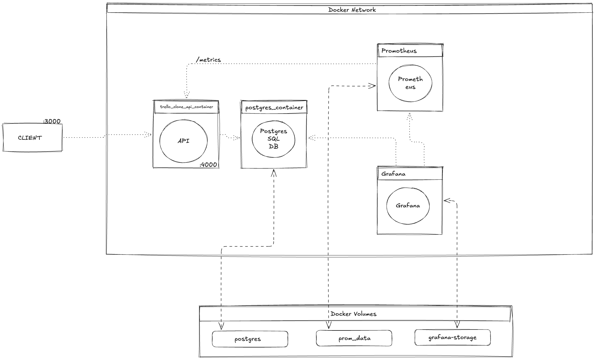

# Project

**Tech stack**
Fastify
knex.js
postgresql
docker

## Architecture

## TODO
* Build Auth service
* Splitting the monolithic Fastify API into API Gateway and separate microservices

### Sources
...

...

###### Reduce docker image size
https://blog.devgenius.io/reduce-the-size-of-your-node-js-docker-image-by-up-to-90-53aad23890e2
https://medium.com/@swappy20_61978/how-to-reduce-your-node-docker-image-size-by-90-for-production-2df3e19b2940
https://mohibulalam75.medium.com/exploring-lightweight-docker-base-images-alpine-slim-and-debian-releases-bookworm-bullseye-688f88067f4b
https://www.specfy.io/blog/1-efficient-dockerfile-nodejs-in-7-steps